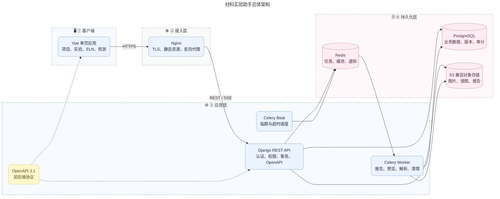
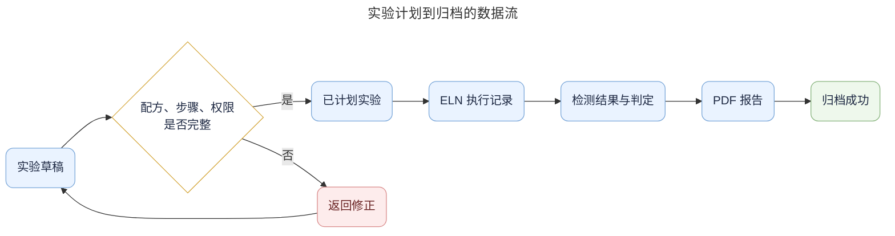

# 系统总体设计

## 1. 架构目标

- 支持 20–100 名并发在线研发人员的首期内部部署。
- 保证项目级数据隔离、ELN 可追溯和文件访问受控。
- 将项目、实验、检测和归档放在同一事务边界内。
- 将耗时文件处理、报告生成和提醒移出同步请求。
- 支持从单机 Docker Compose 平滑迁移到托管数据库和对象存储。

## 2. 技术基线

| 类别 | 版本基线 | 约束 |
|---|---|---|
| Python | 3.14.x 最新补丁 | 只使用受支持依赖 |
| Django | 5.2.x LTS 最新补丁 | 安全支持期优先于功能版 |
| Django REST Framework | 3.17.x | API 与序列化 |
| PostgreSQL | 18.x 最新补丁 | 生产数据库 |
| Celery | 5.6.x | 异步任务和定时任务 |
| Vue | 3.5.x | Composition API + TypeScript |
| Vite | 8.1.x | 构建工具 |
| Element Plus | 2.14.x | 后台组件库 |
| Node.js | 24 LTS | 前端构建环境 |

依赖添加时锁定已验证的精确版本；升级必须阅读对应迁移说明并通过回归测试。

## 3. 总体架构



## 4. 架构边界

### 4.1 前端

- 负责页面状态、表单交互、客户端校验和权限提示。
- 不决定最终权限，不保存业务事实，不生成正式业务编号。
- 不在 `localStorage` 保存令牌、实验内容或文件 Base64。
- 仅保存无敏感性的界面偏好，如侧栏折叠和表格列设置。

### 4.2 API 服务

- 负责认证、权限、数据校验、事务、状态流转和审计。
- 所有查询先应用组织范围，再应用项目范围。
- 跨领域写操作通过应用服务完成，不允许前端拼接多个请求模拟事务。

### 4.3 异步任务

- 报告生成、缩略图、CSV 解析、病毒扫描结果同步和文件清理进入 Celery。
- 任务必须有业务幂等键和重试上限。
- 失败进入可查询状态，禁止无限重试。

### 4.4 数据库

- 保存结构化业务数据、状态、版本和文件元数据。
- 使用外键、唯一约束、检查约束和事务保证一致性。
- `jsonb` 只用于动态参数快照，不替代稳定业务字段。

### 4.5 对象存储

- 对象桶默认私有。
- 浏览器通过短时预签名 URL 上传或下载。
- 对象路径不得包含原始用户输入路径。
- 文件通过哈希、大小、类型和业务引用进行完整性校验。

## 5. 领域模块

```text
backend/
├── config/          # 环境、路由、WSGI/ASGI、Celery
├── apps/
│   ├── accounts/    # 组织、用户、角色
│   ├── projects/    # 项目、成员、里程碑
│   ├── materials/   # 材料、材料批次、单位
│   ├── experiments/ # 实验计划、配方、步骤、模板
│   ├── eln/         # 执行记录、修订、归档
│   ├── testing/     # 送检、结果、标准
│   ├── files/       # 文件对象和业务引用
│   ├── reports/     # 报告模板和生成任务
│   ├── notifications/
│   └── audit/
└── manage.py
```

模块间通过服务接口协作。例如实验归档调用 `eln` 的归档服务和 `audit` 的事件服务，而不是直接修改对方模型。

## 6. 核心数据流

### 6.1 实验计划与执行



### 6.2 文件上传

1. 前端请求上传初始化，提交文件名、大小、MIME 和业务类别。
2. 后端校验权限、配额和允许类型，创建 `file_object`。
3. 后端返回短时预签名上传地址。
4. 浏览器直接上传到对象存储。
5. 前端调用完成接口。
6. 后端校验对象大小和哈希，进入扫描或可用状态。
7. 后端创建 `file_link` 关联业务对象。

## 7. 一致性与并发

- 项目成员调整、实验提交、ELN 归档和结果复核使用数据库事务。
- 可编辑聚合根包含整数 `version`。
- 更新请求携带 `If-Match` 或请求体版本；版本不一致返回 `409 CONFLICT`。
- 正式归档使用行锁防止重复归档。
- 业务编号由数据库序列或专用编号服务生成。
- Celery 任务使用稳定业务键，例如 `report:{report_id}:{template_version}`。

## 8. 缓存策略

首期只缓存以下数据：

- 变化较少的单位、实验类型和文件类别字典。
- 用户会话和短期权限上下文。
- 工作台聚合结果，过期时间不超过 60 秒。

权限结果、ELN 内容和检测判定不得长期缓存。任何缓存都必须以 `organization_id` 参与键构造。

## 9. 可观测性

- 每个请求生成 `request_id` 并返回响应头。
- 日志采用 JSON，包含时间、级别、服务、请求、用户、组织、资源和错误码。
- 不在日志写入密码、Cookie、完整实验内容、文件内容和个人联系方式。
- 关键指标包括请求延迟、错误率、数据库连接、任务积压、报告失败率、对象存储错误和登录失败。
- 错误跟踪系统中的用户标识采用内部 UUID，不发送实验正文。

## 10. 容量初始假设

| 指标 | 首期假设 |
|---|---:|
| 注册用户 | 500 |
| 同时在线 | 100 |
| 项目 | 5,000 |
| 实验 | 200,000 |
| 单实验步骤 | 不超过 200 |
| 单文件 | 默认不超过 200 MB |
| 单实验文件总量 | 默认不超过 2 GB |
| 普通 API P95 | 小于 500 ms |
| 列表查询 P95 | 小于 800 ms |

容量超出假设时，应先通过索引、查询分析、只读副本和对象存储扩容处理，不直接拆分微服务。

## 11. 技术边界

- 普通浏览器通知无法保证浏览器关闭后的提醒。
- SSE 适合单向通知，不适合实时多人编辑。
- PostgreSQL `jsonb` 动态参数便于扩展，但必须配套 Schema 版本和服务端验证。
- PDF 报告只反映已入库数据，不能代替原始检测文件。

## 12. 官方参考

- Python：https://www.python.org/downloads/
- Django：https://www.djangoproject.com/download/
- Django REST Framework：https://www.django-rest-framework.org/community/release-notes/
- Vue：https://vuejs.org/
- Vite：https://vite.dev/releases
- Element Plus：https://github.com/element-plus/element-plus/releases
- PostgreSQL：https://www.postgresql.org/support/versioning/
- Celery：https://docs.celeryq.dev/en/stable/
