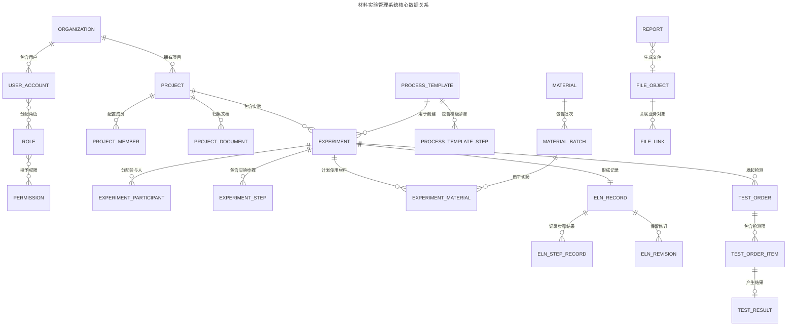

# 数据模型与数据字典

## 1. 数据建模约定

本文件是业务数据表和字段定义的正式来源。实际建表语句应由 Django Migration 生成并提交；如需审查 SQL，统一导出到 `data/ddl/`，不得另建一套手工维护且与模型脱节的 DDL。

### 1.1 通用规则

- 数据库：PostgreSQL，字符集 UTF-8，默认时区 UTC。
- 表名、字段名使用 `snake_case`；表和字段必须在迁移中写入中文 `COMMENT`。
- 主键使用 UUID；业务对象另设稳定、可读且唯一的业务编号。
- 时间字段使用 `timestamptz`，日期字段使用 `date`。
- 精确数量使用 `numeric(20,6)`，换算系数使用 `numeric(24,12)`。
- 状态字段使用稳定英文代码，中文文案由前端字典映射。
- 核心业务表包含 `organization_id`，所有查询先限定组织范围。
- 不实施全局软删除。业务记录以状态、归档或作废表达生命周期；只允许删除未被引用的草稿。
- 动态参数仅允许存入本文件明确指定的 `jsonb` 字段，且必须同时保存 `schema_version`。

### 1.2 通用审计字段

除只追加表和关联表另有说明外，业务表包含：

| 字段 | 类型 | 非空 | 默认值 | 说明 |
|---|---|---:|---|---|
| `id` | `uuid` | 是 | `gen_random_uuid()` | 主键 |
| `created_at` | `timestamptz` | 是 | `now()` | 创建时间 |
| `updated_at` | `timestamptz` | 是 | `now()` | 最后更新时间 |
| `created_by_id` | `uuid` | 否 |  | 创建用户；系统创建时为空 |
| `updated_by_id` | `uuid` | 否 |  | 最后更新用户 |

需要乐观锁的聚合根另含 `version integer NOT NULL DEFAULT 1`。更新时以 `WHERE id = ? AND version = ?` 为条件并原子递增。

## 2. 领域关系

## 3. 身份与权限

### 3.1 `organization` 组织

| 字段 | 类型 | 非空 | 约束/默认 | 说明 |
|---|---|---:|---|---|
| 通用审计字段 |  |  |  | 见 1.2；`created_by_id` 可空 |
| `organization_code` | `varchar(32)` | 是 | 唯一 | 组织代码 |
| `name` | `varchar(200)` | 是 |  | 组织名称 |
| `status` | `varchar(16)` | 是 | `active` | `active/suspended` |

### 3.2 `user_account` 用户

| 字段 | 类型 | 非空 | 约束/默认 | 说明 |
|---|---|---:|---|---|
| 通用审计字段 |  |  |  | 见 1.2 |
| `organization_id` | `uuid` | 是 | 外键 | 所属组织 |
| `username` | `varchar(64)` | 是 | 组织内唯一 | 登录名 |
| `display_name` | `varchar(100)` | 是 |  | 显示名称 |
| `email` | `varchar(254)` | 否 | 组织内唯一（非空） | 邮箱 |
| `password_hash` | `varchar(255)` | 是 |  | Django 密码哈希 |
| `status` | `varchar(16)` | 是 | `active` | `active/locked/disabled` |
| `is_super_admin` | `boolean` | 是 | `false` | 平台超级管理员标记 |
| `last_login_at` | `timestamptz` | 否 |  | 最近登录时间 |

### 3.3 `role` 角色

| 字段 | 类型 | 非空 | 约束/默认 | 说明 |
|---|---|---:|---|---|
| 通用审计字段 |  |  |  | 见 1.2 |
| `organization_id` | `uuid` | 是 | 外键 | 所属组织 |
| `role_code` | `varchar(64)` | 是 | 组织内唯一 | 稳定角色代码 |
| `name` | `varchar(100)` | 是 |  | 角色名称 |
| `description` | `varchar(500)` | 否 |  | 角色说明 |
| `is_system` | `boolean` | 是 | `false` | 是否为不可删除的系统角色 |
| `status` | `varchar(16)` | 是 | `active` | `active/disabled` |

### 3.4 `permission` 权限

| 字段 | 类型 | 非空 | 约束/默认 | 说明 |
|---|---|---:|---|---|
| `id` | `uuid` | 是 | 主键 | 权限 ID |
| `permission_code` | `varchar(100)` | 是 | 唯一 | 例如 `experiment.submit` |
| `name` | `varchar(100)` | 是 |  | 权限名称 |
| `module_code` | `varchar(64)` | 是 |  | 所属模块 |
| `description` | `varchar(500)` | 否 |  | 权限说明 |

### 3.5 `user_role` 用户角色关联

| 字段 | 类型 | 非空 | 约束/默认 | 说明 |
|---|---|---:|---|---|
| `id` | `uuid` | 是 | 主键 | 关联 ID |
| `organization_id` | `uuid` | 是 | 外键 | 所属组织 |
| `user_id` | `uuid` | 是 | 外键 | 用户 |
| `role_id` | `uuid` | 是 | 外键 | 角色 |
| `created_at` | `timestamptz` | 是 | `now()` | 分配时间 |
| `created_by_id` | `uuid` | 否 | 外键 | 分配用户 |

唯一约束为 `(user_id, role_id)`；用户和角色必须属于同一组织。

### 3.6 `role_permission` 角色权限关联

| 字段 | 类型 | 非空 | 约束/默认 | 说明 |
|---|---|---:|---|---|
| `id` | `uuid` | 是 | 主键 | 关联 ID |
| `role_id` | `uuid` | 是 | 外键 | 角色 |
| `permission_id` | `uuid` | 是 | 外键 | 权限 |
| `created_at` | `timestamptz` | 是 | `now()` | 授权时间 |
| `created_by_id` | `uuid` | 否 | 外键 | 授权用户 |

唯一约束为 `(role_id, permission_id)`。

## 4. 项目管理

### 4.1 `project` 项目

| 字段 | 类型 | 非空 | 约束/默认 | 说明 |
|---|---|---:|---|---|
| 通用审计字段 |  |  |  | 见 1.2 |
| `organization_id` | `uuid` | 是 | 外键 | 所属组织 |
| `project_no` | `varchar(32)` | 是 | 组织内唯一 | 项目编号 |
| `name` | `varchar(200)` | 是 |  | 项目名称 |
| `project_type_code` | `varchar(64)` | 是 |  | 项目类型字典代码 |
| `description` | `text` | 否 |  | 目标和范围说明 |
| `current_stage` | `varchar(64)` | 是 | `方案设计` | 当前研发阶段 |
| `progress_percent` | `smallint` | 是 | `0`，范围 0–100 | 由里程碑和实验聚合后物化的项目进度 |
| `document_count` | `integer` | 是 | `0` | 关联文档数量缓存 |
| `experiment_count` | `integer` | 是 | `0` | 关联实验数量缓存 |
| `data_resource_count` | `integer` | 是 | `0` | 关联数据资源数量缓存 |
| `objectives` | `jsonb` | 是 | `[]` | 研发总体目标字符串列表 |
| `milestones` | `jsonb` | 是 | `[]` | 首期里程碑快照，元素含 `date/name/state` |
| `status` | `varchar(24)` | 是 | `draft` | `draft/not_started/active/at_risk/suspended/completed/archived` |
| `owner_id` | `uuid` | 是 | 外键用户 | 项目负责人 |
| `planned_start_date` | `date` | 否 |  | 计划开始日期 |
| `planned_end_date` | `date` | 否 | 不早于开始日期 | 计划结束日期 |
| `actual_end_at` | `timestamptz` | 否 |  | 实际完成时间 |
| `archived_at` | `timestamptz` | 否 |  | 归档时间 |
| `version` | `integer` | 是 | `1` | 乐观锁版本 |

`progress_percent` 和三个数量字段是只读物化值，由领域服务根据里程碑、文档、实验和数据资源更新，
不接受普通项目编辑接口直接修改。首期为对齐原型将里程碑保存在 `milestones` JSON；
进入审批和归档流程前迁移到 4.3 的规范化表，迁移完成后移除 JSON 字段。

### 4.2 `project_member` 项目成员

| 字段 | 类型 | 非空 | 约束/默认 | 说明 |
|---|---|---:|---|---|
| `id` | `uuid` | 是 | 主键 | 关联 ID |
| `organization_id` | `uuid` | 是 | 外键 | 所属组织 |
| `project_id` | `uuid` | 是 | 外键 | 项目 |
| `user_id` | `uuid` | 是 | 外键 | 成员 |
| `member_role` | `varchar(24)` | 是 |  | `owner/researcher/inspector/viewer` |
| `joined_at` | `timestamptz` | 是 | `now()` | 加入时间 |
| `created_by_id` | `uuid` | 否 | 外键 | 操作用户 |

唯一约束：`(project_id, user_id)`。项目负责人必须同时存在一条 `member_role=owner` 的成员记录。

### 4.3 `project_milestone` 项目里程碑

| 字段 | 类型 | 非空 | 约束/默认 | 说明 |
|---|---|---:|---|---|
| 通用审计字段 |  |  |  | 见 1.2 |
| `organization_id` | `uuid` | 是 | 外键 | 所属组织 |
| `project_id` | `uuid` | 是 | 外键 | 项目 |
| `name` | `varchar(200)` | 是 |  | 里程碑名称 |
| `due_date` | `date` | 否 |  | 计划日期 |
| `status` | `varchar(16)` | 是 | `pending` | `pending/completed/cancelled` |
| `completed_at` | `timestamptz` | 否 |  | 完成时间 |
| `sort_order` | `integer` | 是 | `0` | 展示顺序 |

### 4.4 `project_follow` 项目关注

| 字段 | 类型 | 非空 | 约束/默认 | 说明 |
|---|---|---:|---|---|
| `id` | `uuid` | 是 | 主键 | 关注 ID |
| `organization_id` | `uuid` | 是 | 外键 | 所属组织 |
| `project_id` | `uuid` | 是 | 外键 | 项目 |
| `user_id` | `uuid` | 是 | 外键 | 关注用户 |
| `created_at` | `timestamptz` | 是 | `now()` | 关注时间 |

唯一约束为 `(project_id, user_id)`，用于个人工作台，不影响访问权限。

### 4.5 `project_document` 项目文档

| 字段 | 类型 | 非空 | 约束/默认 | 说明 |
|---|---|---:|---|---|
| 通用时间字段 |  |  |  | `created_at/updated_at` |
| `organization_id` | `uuid` | 是 | 外键 | 所属组织 |
| `project_id` | `uuid` | 是 | 外键 | 关联项目 |
| `name` | `varchar(255)` | 是 |  | 客户端原始文档名称 |
| `file` | `varchar(500)` | 是 | 服务端生成路径 | 文档存储路径，不使用原始文件名拼接 |
| `extension` | `varchar(20)` | 是 | 小写 | 文件扩展名 |
| `mime_type` | `varchar(150)` | 否 |  | 客户端 MIME 类型 |
| `file_size` | `bigint` | 是 | `0` | 文件大小，单位字节 |
| `category` | `varchar(32)` | 是 | 枚举 | `project_plan/literature/experiment_plan/stage_report/meeting_minutes/other` |
| `related_content` | `varchar(200)` | 是 | `项目整体` | 关联项目内容或实验编号 |
| `version_label` | `varchar(32)` | 是 | `V1.0` | 业务版本标签 |
| `uploaded_by_id` | `uuid` | 是 | 外键 | 上传用户 |
| `updated_by_id` | `uuid` | 否 | 外键 | 最后更新用户 |

按 `(project_id, category, updated_at DESC)` 和
`(organization_id, extension, updated_at DESC)` 建立索引。项目文档上传成功后由领域服务同步
`project.document_count`；已完成、已归档项目禁止继续上传。

## 5. 基础资料与工艺模板

### 5.1 `unit_definition` 单位

| 字段 | 类型 | 非空 | 约束/默认 | 说明 |
|---|---|---:|---|---|
| 通用审计字段 |  |  |  | 见 1.2 |
| `organization_id` | `uuid` | 是 | 外键 | 所属组织 |
| `unit_code` | `varchar(32)` | 是 | 组织内唯一 | 单位代码 |
| `name` | `varchar(64)` | 是 |  | 中文名称 |
| `symbol` | `varchar(32)` | 是 |  | 展示符号 |
| `dimension_code` | `varchar(32)` | 是 |  | `mass/volume/length/time/temperature/other` |
| `conversion_factor` | `numeric(24,12)` | 是 | `1` | 转换为基准单位的乘数 |
| `conversion_offset` | `numeric(24,12)` | 是 | `0` | 转换偏移量 |
| `is_base_unit` | `boolean` | 是 | `false` | 是否为维度基准单位 |
| `status` | `varchar(16)` | 是 | `active` | `active/disabled` |

换算公式为 `base_value = source_value * conversion_factor + conversion_offset`。温度等带偏移单位必须通过服务层换算。

### 5.2 `material` 材料

| 字段 | 类型 | 非空 | 约束/默认 | 说明 |
|---|---|---:|---|---|
| 通用审计字段 |  |  |  | 见 1.2 |
| `organization_id` | `uuid` | 是 | 外键 | 所属组织 |
| `material_no` | `varchar(32)` | 是 | 组织内唯一 | 材料编号 |
| `name` | `varchar(200)` | 是 |  | 材料名称 |
| `category_code` | `varchar(64)` | 是 |  | 材料分类代码 |
| `specification` | `varchar(200)` | 否 |  | 规格/等级 |
| `cas_no` | `varchar(32)` | 否 |  | CAS 号 |
| `manufacturer` | `varchar(200)` | 否 |  | 生产商 |
| `default_unit_id` | `uuid` | 是 | 外键 | 默认数量单位 |
| `safety_notes` | `text` | 否 |  | 安全与存储提示 |
| `status` | `varchar(16)` | 是 | `active` | `active/disabled` |

### 5.3 `material_batch` 材料批次

| 字段 | 类型 | 非空 | 约束/默认 | 说明 |
|---|---|---:|---|---|
| 通用审计字段 |  |  |  | 见 1.2 |
| `organization_id` | `uuid` | 是 | 外键 | 所属组织 |
| `material_id` | `uuid` | 是 | 外键 | 材料 |
| `batch_no` | `varchar(100)` | 是 | 材料内唯一 | 批次号 |
| `supplier` | `varchar(200)` | 否 |  | 供应商 |
| `production_date` | `date` | 否 |  | 生产日期 |
| `expiry_date` | `date` | 否 |  | 有效期 |
| `initial_quantity` | `numeric(20,6)` | 否 | `>= 0` | 初始数量 |
| `remaining_quantity` | `numeric(20,6)` | 否 | `>= 0` | 剩余数量 |
| `unit_id` | `uuid` | 是 | 外键 | 数量单位 |
| `storage_location` | `varchar(200)` | 否 |  | 存储位置 |
| `status` | `varchar(16)` | 是 | `available` | `available/expired/depleted/disabled` |

MVP 阶段剩余数量用于记录，不实现仓储级强一致扣减；如启用扣减，必须增加独立库存流水表，禁止仅改写剩余量。

### 5.4 `process_block` 工艺块

| 字段 | 类型 | 非空 | 约束/默认 | 说明 |
|---|---|---:|---|---|
| 通用审计字段 |  |  |  | 见 1.2 |
| `organization_id` | `uuid` | 是 | 外键 | 所属组织 |
| `block_code` | `varchar(64)` | 是 | 组织内唯一 | 工艺块代码 |
| `name` | `varchar(200)` | 是 |  | 工艺块名称 |
| `category_code` | `varchar(64)` | 是 |  | 分类代码 |
| `description` | `text` | 否 |  | 使用说明 |
| `parameter_schema` | `jsonb` | 是 | `{}` | 参数 JSON Schema |
| `schema_version` | `integer` | 是 | `1` | 参数结构版本 |
| `status` | `varchar(16)` | 是 | `draft` | `draft/published/retired` |

### 5.5 `process_template` 工艺模板

| 字段 | 类型 | 非空 | 约束/默认 | 说明 |
|---|---|---:|---|---|
| 通用审计字段 |  |  |  | 见 1.2 |
| `organization_id` | `uuid` | 是 | 外键 | 所属组织 |
| `template_code` | `varchar(64)` | 是 |  | 模板代码 |
| `name` | `varchar(200)` | 是 |  | 模板名称 |
| `version_no` | `integer` | 是 | `1` | 模板版本 |
| `description` | `text` | 否 |  | 模板说明 |
| `status` | `varchar(16)` | 是 | `draft` | `draft/published/retired` |
| `published_at` | `timestamptz` | 否 |  | 发布时间 |

唯一约束为 `(organization_id, template_code, version_no)`。已发布模板不可原位修改，应创建新版本。

### 5.6 `process_template_step` 模板步骤

| 字段 | 类型 | 非空 | 约束/默认 | 说明 |
|---|---|---:|---|---|
| 通用审计字段 |  |  |  | 见 1.2 |
| `organization_id` | `uuid` | 是 | 外键 | 所属组织 |
| `template_id` | `uuid` | 是 | 外键 | 工艺模板 |
| `process_block_id` | `uuid` | 否 | 外键 | 来源工艺块 |
| `sequence_no` | `integer` | 是 | `> 0` | 步骤序号 |
| `title` | `varchar(200)` | 是 |  | 步骤标题 |
| `instructions` | `text` | 否 |  | 操作说明 |
| `parameter_values` | `jsonb` | 是 | `{}` | 模板参数值 |
| `schema_version` | `integer` | 是 | `1` | 参数结构版本 |
| `planned_duration_minutes` | `integer` | 否 | `>= 0` | 计划时长 |
| `is_required` | `boolean` | 是 | `true` | 是否必做 |

唯一约束为 `(template_id, sequence_no)`。

## 6. 实验与电子实验记录

### 6.1 `experiment` 实验

| 字段 | 类型 | 非空 | 约束/默认 | 说明 |
|---|---|---:|---|---|
| 通用审计字段 |  |  |  | 见 1.2 |
| `organization_id` | `uuid` | 是 | 外键 | 所属组织 |
| `experiment_no` | `varchar(32)` | 是 | 组织内唯一 | 实验编号 |
| `project_id` | `uuid` | 是 | 外键 | 所属项目 |
| `name` | `varchar(200)` | 是 |  | 实验名称 |
| `experiment_type` | `varchar(64)` | 是 |  | 实验类型 |
| `phase` | `varchar(64)` | 是 | `方案设计` | 当前实验阶段 |
| `purpose` | `text` | 否 |  | 实验目的 |
| `owner_id` | `uuid` | 是 | 外键用户 | 实验负责人 |
| `status` | `varchar(24)` | 是 | `not_started` | `not_started/in_progress/completed` |
| `estimated_start` | `timestamptz` | 否 |  | 预估开始时间 |
| `estimated_end` | `timestamptz` | 否 | 不早于开始时间 | 预估结束时间 |
| `started_at` | `timestamptz` | 否 |  | 实际开始时间 |
| `completed_at` | `timestamptz` | 否 |  | 完成时间 |
| `version` | `integer` | 是 | `1` | 乐观锁版本 |

索引覆盖组织状态、项目状态和负责人状态。当前状态机只允许
`not_started → in_progress → completed`；`completed` 为只读终态。

### 6.2 `experiment_participant` 实验参与人

| 字段 | 类型 | 非空 | 约束/默认 | 说明 |
|---|---|---:|---|---|
| `id` | `uuid` | 是 | 主键 | 关联 ID |
| `organization_id` | `uuid` | 是 | 外键 | 所属组织 |
| `experiment_id` | `uuid` | 是 | 外键 | 实验 |
| `user_id` | `uuid` | 是 | 外键 | 参与用户 |
| `participant_role` | `varchar(24)` | 是 | `participant` | `owner/participant/reviewer` |
| `created_by_id` | `uuid` | 否 | 外键 | 分配用户 |
| `joined_at` | `timestamptz` | 是 | `now()` | 加入时间 |

唯一约束为 `(experiment_id, user_id)`。当前实现会为实验负责人写入 `owner` 关系，
列表对象范围按“实验负责人或参与人”过滤。

### 6.3 `experiment_step` 实验步骤

| 字段 | 类型 | 非空 | 约束/默认 | 说明 |
|---|---|---:|---|---|
| 通用审计字段 |  |  |  | 见 1.2 |
| `organization_id` | `uuid` | 是 | 外键 | 所属组织 |
| `experiment_id` | `uuid` | 是 | 外键 | 实验 |
| `source_template_step_id` | `uuid` | 否 | 外键 | 来源模板步骤 |
| `sequence_no` | `integer` | 是 | `> 0` | 步骤序号 |
| `title` | `varchar(200)` | 是 |  | 步骤标题 |
| `instructions` | `text` | 否 |  | 计划操作说明 |
| `planned_parameters` | `jsonb` | 是 | `{}` | 计划参数 |
| `schema_version` | `integer` | 是 | `1` | 参数结构版本 |
| `planned_duration_minutes` | `integer` | 否 | `>= 0` | 计划时长 |
| `is_required` | `boolean` | 是 | `true` | 是否必做 |

唯一约束为 `(experiment_id, sequence_no)`。实验从模板创建后复制步骤快照，后续模板变更不得影响已有实验。

### 6.4 `experiment_material` 实验材料

| 字段 | 类型 | 非空 | 约束/默认 | 说明 |
|---|---|---:|---|---|
| 通用审计字段 |  |  |  | 见 1.2 |
| `organization_id` | `uuid` | 是 | 外键 | 所属组织 |
| `experiment_id` | `uuid` | 是 | 外键 | 实验 |
| `material_id` | `uuid` | 是 | 外键 | 材料 |
| `material_batch_id` | `uuid` | 否 | 外键 | 实际批次 |
| `purpose` | `varchar(200)` | 否 |  | 用途 |
| `planned_quantity` | `numeric(20,6)` | 否 | `>= 0` | 计划用量 |
| `actual_quantity` | `numeric(20,6)` | 否 | `>= 0` | 实际用量 |
| `unit_id` | `uuid` | 是 | 外键 | 用量单位 |
| `sort_order` | `integer` | 是 | `0` | 展示顺序 |

同一材料可因不同批次或用途重复出现，不建立仅含 `(experiment_id, material_id)` 的唯一约束。

### 6.5 `experiment_record` 电子实验记录

| 字段 | 类型 | 非空 | 约束/默认 | 说明 |
|---|---|---:|---|---|
| `id` | `uuid` | 是 | 主键 | 记录主键 |
| `experiment_id` | `uuid` | 是 | 唯一外键 | 对应实验 |
| `formula_columns` | `jsonb` | 是 | `[]` | 动态配方列，元素含 `id/label` |
| `formula_rows` | `jsonb` | 是 | `[]` | 以列 ID 为键的配方行 |
| `extra_tables` | `jsonb` | 是 | `[]` | 自定义附加表格及列行 |
| `process_text` | `text` | 否 |  | 实验过程文字 |
| `extra_processes` | `jsonb` | 是 | `[]` | 自定义过程模块 |
| `process_images` | `jsonb` | 是 | `[]` | 过程图片 `name/url/size` |
| `result_text` | `text` | 否 |  | 实验结果，最大 1000 字 |
| `result_files` | `jsonb` | 是 | `[]` | 结果附件 `name/size` 元数据 |
| `created_at` | `timestamptz` | 是 | `now()` | 创建时间 |
| `updated_at` | `timestamptz` | 是 | `now()` | 最后更新时间 |

动态结构由 DRF 序列化器约束：配方列 ID 不重复、配方行不得包含未定义列；
过程图片最多 20 张、单张前端限制 10 MB、序列化总量限制约 20 MB；结果附件最多 30 个。
实验聚合根 `version` 负责计划与记录的并发控制。

### 6.6 后续规范化模型

以下 `eln_step_record`、`eln_revision` 等模型属于归档与合规阶段目标模型，当前迁移尚未创建。

### 6.6.1 `eln_step_record` 步骤记录

| 字段 | 类型 | 非空 | 约束/默认 | 说明 |
|---|---|---:|---|---|
| 通用审计字段 |  |  |  | 见 1.2 |
| `organization_id` | `uuid` | 是 | 外键 | 所属组织 |
| `eln_record_id` | `uuid` | 是 | 外键 | 电子实验记录 |
| `experiment_step_id` | `uuid` | 是 | 外键且记录内唯一 | 实验步骤 |
| `actual_parameters` | `jsonb` | 是 | `{}` | 实际参数 |
| `schema_version` | `integer` | 是 | `1` | 参数结构版本 |
| `observation` | `text` | 否 |  | 实验现象 |
| `result_summary` | `text` | 否 |  | 步骤结果 |
| `anomaly_description` | `text` | 否 |  | 异常说明 |
| `completed_at` | `timestamptz` | 否 |  | 步骤完成时间 |
| `version` | `integer` | 是 | `1` | 乐观锁版本 |

### 6.6.2 `eln_revision` ELN 修订

该表只追加，不更新、不删除。

| 字段 | 类型 | 非空 | 约束/默认 | 说明 |
|---|---|---:|---|---|
| `id` | `uuid` | 是 | 主键 | 修订 ID |
| `organization_id` | `uuid` | 是 | 外键 | 所属组织 |
| `eln_record_id` | `uuid` | 是 | 外键 | 电子实验记录 |
| `revision_no` | `integer` | 是 | 记录内唯一 | 修订号 |
| `action` | `varchar(24)` | 是 |  | `submit/reject/archive` |
| `content_snapshot` | `jsonb` | 是 |  | 完整内容快照 |
| `schema_version` | `integer` | 是 |  | 快照结构版本 |
| `change_summary` | `text` | 否 |  | 修改说明或退回原因 |
| `created_by_id` | `uuid` | 是 | 外键 | 操作用户 |
| `created_at` | `timestamptz` | 是 | `now()` | 修订时间 |

唯一约束为 `(eln_record_id, revision_no)`。归档快照一经生成不得覆盖。

## 7. 检测与报告

### 7.1 `test_standard` 检测标准

| 字段 | 类型 | 非空 | 约束/默认 | 说明 |
|---|---|---:|---|---|
| 通用审计字段 |  |  |  | 见 1.2 |
| `organization_id` | `uuid` | 是 | 外键 | 所属组织 |
| `standard_code` | `varchar(64)` | 是 |  | 标准代码 |
| `version_no` | `integer` | 是 | `1` | 内部版本 |
| `name` | `varchar(200)` | 是 |  | 标准名称 |
| `method_description` | `text` | 否 |  | 检测方法 |
| `result_schema` | `jsonb` | 是 | `{}` | 结果结构 JSON Schema |
| `schema_version` | `integer` | 是 | `1` | 结构版本 |
| `status` | `varchar(16)` | 是 | `draft` | `draft/published/retired` |
| `published_at` | `timestamptz` | 否 |  | 发布时间 |

唯一约束为 `(organization_id, standard_code, version_no)`。

### 7.2 `test_order` 检测委托

| 字段 | 类型 | 非空 | 约束/默认 | 说明 |
|---|---|---:|---|---|
| 通用审计字段 |  |  |  | 见 1.2 |
| `organization_id` | `uuid` | 是 | 外键 | 所属组织 |
| `test_order_no` | `varchar(32)` | 是 | 组织内唯一 | 检测委托编号 |
| `experiment_id` | `uuid` | 是 | 外键 | 来源实验 |
| `requester_id` | `uuid` | 是 | 外键用户 | 委托人 |
| `assignee_id` | `uuid` | 否 | 外键用户 | 检测负责人 |
| `status` | `varchar(24)` | 是 | `draft` | 检测状态 |
| `priority` | `varchar(16)` | 是 | `normal` | `low/normal/high/urgent` |
| `sample_name` | `varchar(200)` | 是 |  | 样品名称 |
| `sample_quantity` | `numeric(20,6)` | 否 | `>= 0` | 样品数量 |
| `sample_unit_id` | `uuid` | 否 | 外键 | 样品单位 |
| `due_at` | `timestamptz` | 否 |  | 要求完成时间 |
| `notes` | `text` | 否 |  | 委托说明 |
| `submitted_at` | `timestamptz` | 否 |  | 提交时间 |
| `completed_at` | `timestamptz` | 否 |  | 完成时间 |
| `version` | `integer` | 是 | `1` | 乐观锁版本 |

### 7.3 `test_order_item` 检测项

| 字段 | 类型 | 非空 | 约束/默认 | 说明 |
|---|---|---:|---|---|
| 通用审计字段 |  |  |  | 见 1.2 |
| `organization_id` | `uuid` | 是 | 外键 | 所属组织 |
| `test_order_id` | `uuid` | 是 | 外键 | 检测委托 |
| `test_standard_id` | `uuid` | 否 | 外键 | 检测标准版本 |
| `item_code` | `varchar(64)` | 是 |  | 检测项代码 |
| `item_name` | `varchar(200)` | 是 |  | 检测项名称 |
| `unit_id` | `uuid` | 否 | 外键 | 默认结果单位 |
| `acceptance_rule` | `jsonb` | 是 | `{}` | 判定规则快照 |
| `schema_version` | `integer` | 是 | `1` | 规则结构版本 |
| `sequence_no` | `integer` | 是 | `> 0` | 展示顺序 |

唯一约束为 `(test_order_id, sequence_no)`。

### 7.4 `test_result` 检测结果

| 字段 | 类型 | 非空 | 约束/默认 | 说明 |
|---|---|---:|---|---|
| 通用审计字段 |  |  |  | 见 1.2 |
| `organization_id` | `uuid` | 是 | 外键 | 所属组织 |
| `test_order_item_id` | `uuid` | 是 | 唯一外键 | 检测项 |
| `value_numeric` | `numeric(20,6)` | 否 |  | 数值结果 |
| `value_text` | `text` | 否 |  | 文本结果 |
| `unit_id` | `uuid` | 否 | 外键 | 结果单位 |
| `structured_result` | `jsonb` | 是 | `{}` | 复杂结果和原始点位 |
| `schema_version` | `integer` | 是 | `1` | 结果结构版本 |
| `conclusion` | `varchar(16)` | 是 | `pending` | `pending/pass/fail/invalid` |
| `entered_by_id` | `uuid` | 是 | 外键用户 | 录入人 |
| `entered_at` | `timestamptz` | 是 | `now()` | 录入时间 |
| `reviewed_by_id` | `uuid` | 否 | 外键用户 | 审核人 |
| `reviewed_at` | `timestamptz` | 否 |  | 审核时间 |
| `version` | `integer` | 是 | `1` | 乐观锁版本 |

`value_numeric`、`value_text` 和 `structured_result` 至少有一项包含有效结果。完成审核后只能通过作废并重新录入纠正，不直接覆盖已审核结果。

### 7.5 `report` 报告

| 字段 | 类型 | 非空 | 约束/默认 | 说明 |
|---|---|---:|---|---|
| 通用审计字段 |  |  |  | 见 1.2 |
| `organization_id` | `uuid` | 是 | 外键 | 所属组织 |
| `report_no` | `varchar(32)` | 是 | 组织内唯一 | 报告编号 |
| `report_type` | `varchar(32)` | 是 |  | `experiment/test/project_summary` |
| `source_type` | `varchar(32)` | 是 |  | 来源对象类型 |
| `source_id` | `uuid` | 是 |  | 来源对象 ID |
| `template_version` | `varchar(32)` | 是 |  | 报告模板版本 |
| `status` | `varchar(16)` | 是 | `queued` | `queued/generating/ready/failed/void` |
| `input_snapshot` | `jsonb` | 是 |  | 生成输入快照 |
| `schema_version` | `integer` | 是 | `1` | 快照结构版本 |
| `file_id` | `uuid` | 否 | 外键 | 生成文件 |
| `requested_by_id` | `uuid` | 是 | 外键用户 | 发起人 |
| `requested_at` | `timestamptz` | 是 | `now()` | 发起时间 |
| `generated_at` | `timestamptz` | 否 |  | 生成完成时间 |
| `error_code` | `varchar(64)` | 否 |  | 稳定错误码 |
| `error_summary` | `varchar(500)` | 否 |  | 脱敏错误摘要 |
| `version` | `integer` | 是 | `1` | 乐观锁版本 |

## 8. 文件、通知与系统表

### 8.1 `file_object` 文件对象

| 字段 | 类型 | 非空 | 约束/默认 | 说明 |
|---|---|---:|---|---|
| 通用审计字段 |  |  |  | 见 1.2 |
| `organization_id` | `uuid` | 是 | 外键 | 所属组织 |
| `original_file_name` | `varchar(255)` | 是 |  | 原始文件名 |
| `storage_key` | `varchar(512)` | 是 | 唯一 | 对象存储键 |
| `content_type` | `varchar(128)` | 是 |  | 服务端确认的 MIME |
| `size_bytes` | `bigint` | 是 | `>= 0` | 文件大小 |
| `sha256` | `char(64)` | 否 |  | 内容摘要 |
| `status` | `varchar(16)` | 是 | `initialized` | `initialized/uploading/scanning/available/rejected/deleted` |
| `uploaded_by_id` | `uuid` | 是 | 外键用户 | 上传人 |
| `uploaded_at` | `timestamptz` | 否 |  | 上传确认时间 |
| `scan_result_code` | `varchar(64)` | 否 |  | 扫描结果码 |
| `retention_until` | `date` | 否 |  | 最短保留日期 |

### 8.2 `file_link` 文件关联

| 字段 | 类型 | 非空 | 约束/默认 | 说明 |
|---|---|---:|---|---|
| `id` | `uuid` | 是 | 主键 | 关联 ID |
| `organization_id` | `uuid` | 是 | 外键 | 所属组织 |
| `file_id` | `uuid` | 是 | 外键 | 文件 |
| `resource_type` | `varchar(32)` | 是 |  | 受控资源类型 |
| `resource_id` | `uuid` | 是 |  | 资源 ID |
| `purpose` | `varchar(32)` | 是 |  | `attachment/raw_data/image/report` |
| `sort_order` | `integer` | 是 | `0` | 展示顺序 |
| `linked_by_id` | `uuid` | 是 | 外键用户 | 关联人 |
| `linked_at` | `timestamptz` | 是 | `now()` | 关联时间 |

唯一约束为 `(file_id, resource_type, resource_id, purpose)`。`resource_type` 由服务端白名单控制。

### 8.3 `notification` 站内通知

| 字段 | 类型 | 非空 | 约束/默认 | 说明 |
|---|---|---:|---|---|
| `id` | `uuid` | 是 | 主键 | 通知 ID |
| `organization_id` | `uuid` | 是 | 外键 | 所属组织 |
| `recipient_id` | `uuid` | 是 | 外键用户 | 接收人 |
| `notification_type` | `varchar(64)` | 是 |  | 通知类型 |
| `title` | `varchar(200)` | 是 |  | 标题 |
| `body` | `text` | 是 |  | 正文 |
| `resource_type` | `varchar(32)` | 否 |  | 关联资源类型 |
| `resource_id` | `uuid` | 否 |  | 关联资源 ID |
| `read_at` | `timestamptz` | 否 |  | 阅读时间 |
| `created_at` | `timestamptz` | 是 | `now()` | 创建时间 |

### 8.4 `audit_log` 审计日志

该表只追加，禁止通过业务接口更新或删除。

| 字段 | 类型 | 非空 | 约束/默认 | 说明 |
|---|---|---:|---|---|
| `id` | `uuid` | 是 | 主键 | 事件 ID |
| `organization_id` | `uuid` | 是 | 外键 | 所属组织 |
| `request_id` | `uuid` | 是 |  | 请求追踪 ID |
| `actor_user_id` | `uuid` | 否 | 外键 | 操作用户；系统任务可空 |
| `actor_type` | `varchar(16)` | 是 | `user` | `user/system` |
| `action` | `varchar(100)` | 是 |  | 稳定动作代码 |
| `resource_type` | `varchar(32)` | 是 |  | 对象类型 |
| `resource_id` | `uuid` | 否 |  | 对象 ID |
| `before_data` | `jsonb` | 否 |  | 变更前脱敏摘要 |
| `after_data` | `jsonb` | 否 |  | 变更后脱敏摘要 |
| `outcome` | `varchar(16)` | 是 |  | `success/denied/failed` |
| `error_code` | `varchar(64)` | 否 |  | 失败错误码 |
| `ip_address` | `inet` | 否 |  | 客户端 IP |
| `user_agent` | `varchar(500)` | 否 |  | 客户端标识 |
| `occurred_at` | `timestamptz` | 是 | `now()` | 事件时间 |

数据量达到单月千万级前不引入分区；达到阈值后按 `occurred_at` 月度分区。敏感正文、密码、Cookie、上传签名地址不得进入审计快照。

### 8.5 `business_number_sequence` 业务编号序列

| 字段 | 类型 | 非空 | 约束/默认 | 说明 |
|---|---|---:|---|---|
| `id` | `uuid` | 是 | 主键 | 序列 ID |
| `organization_id` | `uuid` | 是 | 外键 | 所属组织 |
| `business_type` | `varchar(32)` | 是 |  | `project/experiment/test_order/report/eln` |
| `period_key` | `varchar(16)` | 是 |  | 周期键，例如 `2026` |
| `current_value` | `bigint` | 是 | `0` | 当前已分配序号 |
| `updated_at` | `timestamptz` | 是 | `now()` | 更新时间 |

唯一约束为 `(organization_id, business_type, period_key)`。编号服务通过行锁递增，禁止读取最大业务编号推算。

### 8.6 `idempotency_request` 幂等请求

| 字段 | 类型 | 非空 | 约束/默认 | 说明 |
|---|---|---:|---|---|
| `id` | `uuid` | 是 | 主键 | 幂等记录 ID |
| `organization_id` | `uuid` | 是 | 外键 | 所属组织 |
| `user_id` | `uuid` | 是 | 外键 | 请求用户 |
| `idempotency_key` | `varchar(128)` | 是 |  | 客户端幂等键 |
| `route_key` | `varchar(200)` | 是 |  | 稳定路由和动作标识 |
| `request_hash` | `char(64)` | 是 |  | 规范化请求摘要 |
| `status` | `varchar(16)` | 是 | `processing` | `processing/completed/failed` |
| `response_status` | `smallint` | 否 |  | 首次响应状态码 |
| `response_body` | `jsonb` | 否 |  | 可安全重放的脱敏响应 |
| `created_at` | `timestamptz` | 是 | `now()` | 创建时间 |
| `expires_at` | `timestamptz` | 是 |  | 过期时间 |

唯一约束为 `(organization_id, user_id, route_key, idempotency_key)`。登录、文件签名地址和包含敏感信息的响应不进入重放记录。

### 8.7 `dictionary_type` 字典类型

| 字段 | 类型 | 非空 | 约束/默认 | 说明 |
|---|---|---:|---|---|
| 通用审计字段 |  |  |  | 见 1.2 |
| `organization_id` | `uuid` | 是 | 外键 | 所属组织 |
| `type_code` | `varchar(64)` | 是 | 组织内唯一 | 例如 `project_type` |
| `name` | `varchar(100)` | 是 |  | 字典类型名称 |
| `status` | `varchar(16)` | 是 | `active` | `active/disabled` |

### 8.8 `dictionary_item` 字典项

| 字段 | 类型 | 非空 | 约束/默认 | 说明 |
|---|---|---:|---|---|
| 通用审计字段 |  |  |  | 见 1.2 |
| `organization_id` | `uuid` | 是 | 外键 | 所属组织 |
| `dictionary_type_id` | `uuid` | 是 | 外键 | 字典类型 |
| `item_code` | `varchar(64)` | 是 | 类型内唯一 | 稳定字典代码 |
| `item_name` | `varchar(100)` | 是 |  | 展示名称 |
| `sort_order` | `integer` | 是 | `0` | 展示顺序 |
| `status` | `varchar(16)` | 是 | `active` | `active/disabled` |
| `extra_data` | `jsonb` | 是 | `{}` | 颜色、图标等非业务展示扩展 |

## 9. 关键索引

除主键、唯一约束和外键索引外，建立以下查询索引：

| 索引名 | 表与字段 | 目的 |
|---|---|---|
| `idx_project_org_status_updated` | `project(organization_id, status, updated_at DESC)` | 项目列表 |
| `idx_project_owner_status` | `project(organization_id, owner_id, status)` | 我的项目 |
| `idx_project_member_user` | `project_member(organization_id, user_id, project_id)` | 数据范围过滤 |
| `idx_experiment_project_status_updated` | `experiment(organization_id, project_id, status, updated_at DESC)` | 项目实验列表 |
| `idx_experiment_owner_status` | `experiment(organization_id, owner_id, status, updated_at DESC)` | 我的实验 |
| `idx_experiment_participant_user` | `experiment_participant(organization_id, user_id, experiment_id)` | 参与实验范围过滤 |
| `idx_material_name` | `material(organization_id, name)` | 材料检索 |
| `idx_material_cas_no` | `material(organization_id, cas_no)`，非空条件索引 | CAS 检索 |
| `idx_material_batch_expiry` | `material_batch(organization_id, status, expiry_date)` | 批次有效期 |
| `idx_test_order_assignee_status_due` | `test_order(organization_id, assignee_id, status, due_at)` | 检测工作台 |
| `idx_notification_unread` | `notification(recipient_id, created_at DESC)`，`read_at IS NULL` | 未读通知 |
| `idx_file_sha256` | `file_object(organization_id, sha256)`，非空条件索引 | 内容查重 |
| `idx_file_link_resource` | `file_link(organization_id, resource_type, resource_id)` | 附件列表 |
| `idx_audit_resource_time` | `audit_log(organization_id, resource_type, resource_id, occurred_at DESC)` | 对象审计轨迹 |
| `idx_audit_actor_time` | `audit_log(organization_id, actor_user_id, occurred_at DESC)` | 用户审计查询 |

索引必须由真实查询计划验证。新增复合索引时记录对应接口和慢查询证据，不根据字段猜测批量建索引。

## 10. JSON 字段治理

`parameter_schema`、`result_schema` 采用受限 JSON Schema；业务快照字段保存生成时的完整可解释数据。规则如下：

- 每个 JSON 结构都有整数 `schema_version`。
- API 层校验结构、字段类型、单位引用和值域。
- 已发布模板和已提交快照保持原版本，不进行静默原地迁移。
- 新版本读取旧数据时通过显式转换器适配。
- 频繁筛选、关联、唯一约束或排序的字段不得藏在 JSON 中。
- JSON 体积默认限制 512 KB；原始大数据保存为文件对象。

## 11. 数据保留与迁移

- 审计日志、ELN 修订、已审核检测结果和正式报告默认长期保留，具体年限由组织合规要求确认。
- 文件对象只有在不存在业务关联、超过保留期且完成审计记录后才可进入删除流程。
- 每次模型变更包含正向迁移、数据修复策略、回滚边界和测试。
- 破坏性迁移采用“扩展—回填—切换—收缩”四阶段，不在一次发布中直接删除仍被旧版本读取的字段。
