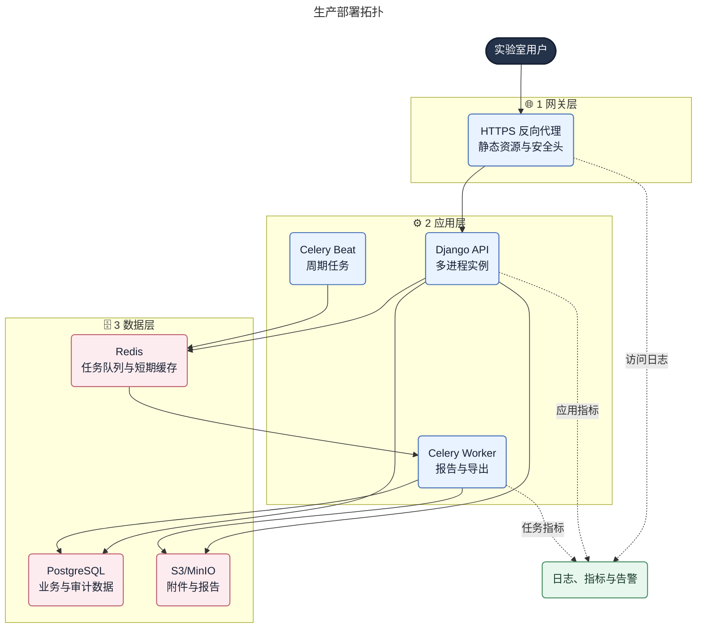

# 部署、运维与实施路线图

## 1. 环境划分

| 环境 | 用途 | 数据要求 |
|---|---|---|
| 本地开发 | 单人开发和快速测试 | 合成数据 |
| 测试 | 持续集成和功能测试 | 自动重置的合成数据 |
| 预发布 | 发布演练、迁移和性能验证 | 脱敏或等比例合成数据 |
| 生产 | 正式业务 | 受控访问、备份和审计 |

各环境使用独立数据库、对象存储桶、Redis 命名空间和密钥。禁止生产凭据下发到开发或测试环境。

## 2. 部署拓扑



MVP 使用 Docker Compose 部署单套模块化单体，服务包括反向代理、Web API、Celery Worker、可选 Celery Beat、PostgreSQL、Redis 和 MinIO。生产规模增长后优先拆分数据库、对象存储和 Worker 资源，不提前拆业务微服务。

## 3. 镜像与发布

- 前端构建为静态资源，由反向代理提供。
- 后端镜像采用固定 Python 基础镜像摘要，多阶段构建，非 root 用户运行。
- Web、Worker 和管理命令使用同一后端镜像和依赖锁。
- 镜像内不包含 `.env`、上传文件、测试数据和构建凭据。
- 每个发布产物带 Git 提交、版本号、构建时间和数据库迁移编号。
- 容器启动前不自动执行不可控迁移；迁移作为显式发布步骤执行。

发布顺序：

1. 验证备份、空间和依赖健康。
2. 部署向后兼容的数据库扩展迁移。
3. 发布后端和 Worker。
4. 发布前端静态资源。
5. 执行数据回填或切换。
6. 完成健康检查和核心流程冒烟。
7. 观察稳定后再执行字段收缩迁移。

## 4. 配置与密钥

`.env.example` 只列变量名和非敏感示例。至少包含：

| 配置域 | 变量示例 | 说明 |
|---|---|---|
| Django | `DJANGO_SETTINGS_MODULE`, `DJANGO_SECRET_KEY` | 环境配置和密钥 |
| 数据库 | `DATABASE_URL` | PostgreSQL 连接 |
| Redis | `REDIS_URL` | 队列与缓存 |
| 对象存储 | `S3_ENDPOINT_URL`, `S3_BUCKET_NAME`, `S3_ACCESS_KEY_ID`, `S3_SECRET_ACCESS_KEY` | 文件存储 |
| Web | `ALLOWED_HOSTS`, `CSRF_TRUSTED_ORIGINS`, `CORS_ALLOWED_ORIGINS` | 来源控制 |
| 邮件/通知 | `EMAIL_BACKEND`, `EMAIL_HOST` | 后续邮件通知 |
| 监控 | `LOG_LEVEL`, `ERROR_TRACKING_DSN` | 日志和错误跟踪 |

生产密钥使用主机 Secret、容器 Secret 或组织密钥管理服务注入，并建立轮换流程。

## 5. 数据目录与备份

如在远程单机使用 Docker Compose，持久化数据统一放置于：

```text
~/work/data/docker/materials-lab-assistant/
├── postgres/
├── redis/
├── minio/
└── backup/
```

推荐备份策略：

- PostgreSQL：每日逻辑或物理全量备份，并启用连续归档以满足生产 RPO。
- 对象存储：开启版本控制或增量同步，数据库备份与对象备份记录同一时间窗口。
- 配置：备份非敏感部署配置和迁移版本，不备份明文密钥。
- 保留：至少保留 7 个日备份、4 个周备份和 6 个按月恢复点；最终以组织制度为准。
- 恢复：每季度在隔离环境恢复数据库和对象存储，验证 ELN 附件、报告链接和审计记录。

Redis 不作为业务事实来源，丢失后允许重建；任务必须能够根据数据库状态安全重试。

## 6. 健康检查与监控

| 检查 | 路径/指标 | 说明 |
|---|---|---|
| 存活 | `/api/v1/health/live` | 进程可响应，不探测外部依赖 |
| 就绪 | `/api/v1/health/ready` | 数据库可用且迁移版本正确 |
| 队列 | 等待数、最老任务年龄、失败数 | 识别任务积压 |
| 数据库 | 连接、慢查询、锁等待、磁盘 | 识别容量和查询问题 |
| 对象存储 | 请求错误率、空间、延迟 | 识别上传/下载异常 |
| Web | 请求量、P95、5xx、401/403 异常增长 | 服务质量和攻击迹象 |

日志使用 JSON 结构输出并携带 `request_id`。应用日志、访问日志和审计日志逻辑分离；不得用应用日志替代审计日志。

建议告警：

- 5 分钟内 5xx 超过 2%。
- 就绪检查连续 3 次失败。
- 数据库剩余空间低于 20%。
- Celery 最老任务等待超过 10 分钟。
- 报告任务失败率在 15 分钟窗口超过 5%。
- 备份连续一次失败或恢复演练未通过。

## 7. 故障与回滚

运行手册至少覆盖：

- Web 服务不可用。
- 数据库连接耗尽或锁等待。
- Celery 队列积压。
- MinIO/S3 不可用。
- 报告批量失败。
- 文件扫描服务不可用。
- 数据误操作和跨组织访问事件。

应用回滚只允许回到兼容当前数据库结构的版本。数据库回滚优先使用前向修复迁移；涉及不可逆数据转换时，从已验证备份恢复并同步对象存储时间点。任何生产数据修复脚本需先在副本验证，记录输入范围、执行人、时间和结果。

## 8. 实施路线图

按 1 名前端、1 名后端、0.5 名测试/产品配合估算，MVP 约 12–14 周：

| 阶段 | 周期 | 主要产物 | 退出条件 |
|---|---:|---|---|
| 0. 基线确认 | 1 周 | 术语、状态机、线框、OpenAPI 基线、数据模型 | 关键开放问题关闭 |
| 1. 工程与身份 | 2 周 | 前后端骨架、会话、RBAC、CI、基础布局 | 登录和权限冒烟通过 |
| 2. 项目与基础资料 | 2 周 | 项目、成员、材料、单位、工艺模板 | 可创建并激活项目 |
| 3. 实验与 ELN | 4 周 | 实验计划、执行、自动保存、修订和归档 | 核心闭环 E2E 通过 |
| 4. 检测与报告 | 2–3 周 | 检测委托、结果审核、报告任务、附件 | 检测报告闭环通过 |
| 5. 加固与上线 | 2 周 | 性能、安全、迁移、监控、备份恢复、培训 | 发布门禁全部通过 |

若仅 1 名全栈开发，建议按 16–20 周评估。以下因素会显著增加周期：仪器自动采集、复杂报告模板、单点登录、电子签名、法规验证、多组织计费和移动端完整编辑。

## 9. 上线前决策

在阶段 0 结束前确认：

1. ELN 归档是否属于法规意义上的不可变记录，是否需要电子签名和时间戳服务。
2. 检测结果审核是否强制录入人与审核人分离。
3. 材料批次是否需要真实库存流水和锁定/扣减。
4. 报告格式、模板维护主体和正式编号规则。
5. 数据保留年限、备份 RPO/RTO 和部署网络边界。

上述决策影响数据模型、权限和验收，未确认时只能按当前基线实现可替换接口，不能假设为最终合规结论。
