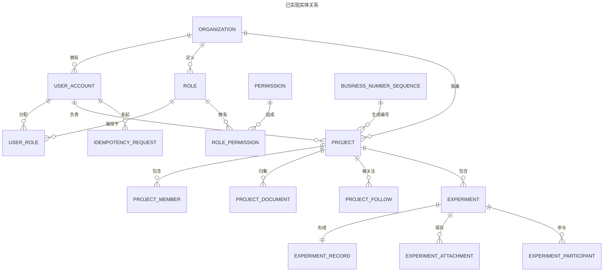
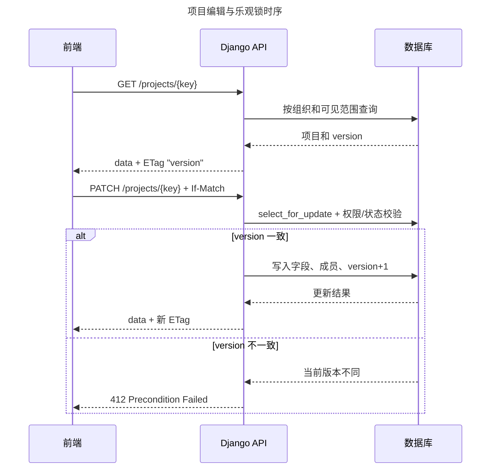

# 材料实验助手详细设计

## 1. 文档范围与事实来源

本文件是项目唯一的详细设计，描述 `dev` 分支提交 `ded1dfc` 中已经实现的结构。实现事实以 Django Model、Migration、Serializer、View、前端接口调用和自动化测试为准。未实现的检测、报告、材料主数据和完整审计功能不在本文实现范围内。

| 设计对象 | 当前事实来源 | 使用说明 |
|---|---|---|
| 数据库物理结构 | `backend/apps/*/migrations/` | 新增字段必须先更新 Migration，再更新本文 |
| API 路径与行为 | `backend/apps/*/urls.py`、`views.py` | 本文仅汇总公开资源和关键行为 |
| 权限与数据范围 | `identity/models.py`、selectors、services | 前端按钮不是授权依据 |
| 页面与交互 | `frontend/src/` | 以真实 API 返回的数据和当前页面为准 |

## 2. 实现结构

```text
backend/
├── config/                       # Django 配置、总路由、WSGI/ASGI
├── apps/
│   ├── common/                   # 时间戳基类、幂等、分页、异常、请求编号
│   ├── identity/                 # 组织、用户、角色、权限和会话接口
│   ├── projects/                 # 项目、成员、文档、关注、总览
│   └── experiments/              # 实验、ELN、附件、参与人、状态迁移
└── tests/                        # pytest 核心路径测试

frontend/src/
├── api/                          # Axios 请求封装及业务 API
├── components/projects/          # 文档、实验、数据资产页签组件
├── views/                        # 登录、总览、项目、ELN、用户管理页面
├── stores/                       # 会话和权限状态
├── router/                       # 页面路由及访问控制
└── types/                        # 前端 API 类型
```

## 3. 数据库设计

### 3.1 通用约定

- `TimeStampedModel` 统一提供 `id UUID`、`created_at`、`updated_at`。
- 表名和字段名均为 `snake_case`，Migration 中定义中文表/字段注释。
- 业务对象以 `organization_id` 作为组织隔离键；所有对象访问先通过组织范围过滤。
- `project.version` 与 `experiment.version` 是乐观锁版本。更新请求必须携带 `If-Match: "<version>"`。
- 当前数据库迁移为三类 App：`common`、`identity`、`projects`、`experiments`；不以设计文档中的未来实体替代已落地实体。

### 3.2 实体关系



### 3.3 表与关键字段

下表列出已实现表的完整业务字段集合；所有带 `*` 的表还继承或自定义了 `id` 与时间字段，外键实际列以 `_id` 结尾。

| 表 | 关键字段 | 约束/索引 | 说明 |
|---|---|---|---|
| `organization`* | `organization_code`, `name`, `status` | `organization_code` 唯一 | 组织数据隔离根 |
| `user_account` | `id`, `organization_id`, `username`, `display_name`, `email`, `status`, `is_super_admin`, Django 密码与认证字段 | 组织内用户名唯一；非空邮箱组织内唯一；`idx_user_org_status` | 登录用户 |
| `role`* | `organization_id`, `role_code`, `name`, `description`, `is_system`, `status` | `(organization_id, role_code)` 唯一 | 组织内角色 |
| `permission` | `id`, `permission_code`, `name`, `module_code`, `description` | `permission_code` 唯一 | 稳定权限码 |
| `user_role` | `id`, `organization_id`, `user_id`, `role_id`, `created_at`, `created_by_id` | `(user_id, role_id)` 唯一 | 用户角色关联 |
| `role_permission` | `id`, `role_id`, `permission_id`, `created_at`, `created_by_id` | `(role_id, permission_id)` 唯一 | 角色权限关联 |
| `business_number_sequence` | `id`, `organization_id`, `business_type`, `period_key`, `current_value`, `updated_at` | `(organization_id, business_type, period_key)` 唯一 | 项目编号序列 |
| `project`* | `organization_id`, `project_no`, `name`, `project_type_code`, `description`, `current_stage`, `progress_percent`, `document_count`, `experiment_count`, `data_resource_count`, `objectives`, `milestones`, `status`, `owner_id`, `planned_start_date`, `planned_end_date`, `actual_end_at`, `archived_at`, `version`, `created_by_id`, `updated_by_id` | 组织内项目编号唯一；日期顺序与进度范围检查；项目状态/负责人索引 | 项目聚合根 |
| `project_member` | `id`, `organization_id`, `project_id`, `user_id`, `member_role`, `joined_at`, `created_by_id` | `(project_id, user_id)` 唯一；成员查询索引 | 项目成员和负责人关系 |
| `project_follow` | `id`, `organization_id`, `project_id`, `user_id`, `created_at` | `(project_id, user_id)` 唯一；用户关注索引 | 个人工作台关注项 |
| `project_document`* | `organization_id`, `project_id`, `name`, `file`, `extension`, `mime_type`, `file_size`, `category`, `related_content`, `version_label`, `uploaded_by_id`, `updated_by_id` | 项目分类更新时间、组织扩展名更新时间索引 | 项目文档元数据和文件路径 |
| `experiment`* | `organization_id`, `project_id`, `experiment_no`, `name`, `experiment_type`, `phase`, `status`, `purpose`, `estimated_start`, `estimated_end`, `started_at`, `completed_at`, `owner_id`, `version`, `created_by_id`, `updated_by_id` | 组织内实验编号唯一；计划时间检查；组织/项目/负责人状态索引 | 实验聚合根 |
| `experiment_record`* | `experiment_id`, `formula_columns`, `formula_rows`, `extra_tables`, `process_text`, `extra_processes`, `process_images`, `result_text`, `result_files` | `experiment_id` 一对一 | 结构化 ELN 正文 |
| `experiment_attachment`* | `organization_id`, `experiment_id`, `kind`, `name`, `file`, `mime_type`, `file_size`, `uploaded_by_id` | 组织、实验、用途、创建时间索引 | 真实过程图片或结果附件 |
| `experiment_participant` | `id`, `organization_id`, `experiment_id`, `user_id`, `participant_role`, `joined_at`, `created_by_id` | `(experiment_id, user_id)` 唯一；参与人查询索引 | 实验参与人 |
| `idempotency_request` | `id`, `organization_id`, `user_id`, `idempotency_key`, `route_key`, `request_hash`, `status`, `response_status`, `response_body`, `created_at`, `expires_at` | 请求作用域和幂等键唯一；过期时间索引 | 创建和迁移请求去重 |

### 3.4 状态和值域

| 对象 | 枚举值 | 设计规则 |
|---|---|---|
| 项目 | `draft`、`not_started`、`active`、`at_risk`、`suspended`、`completed`、`archived` | 前五种可编辑；完成和归档只读 |
| 项目成员 | `owner`、`researcher`、`inspector`、`viewer` | 项目负责人须同步存在 `owner` 成员记录 |
| 实验 | `not_started`、`in_progress`、`completed` | 完成后禁止 ELN 写入 |
| 实验参与人 | `owner`、`participant`、`reviewer` | 参与关系以项目可见范围为前提 |
| 实验附件 | `process_image`、`result_file` | 附件数量和总大小由服务层校验 |
| 幂等请求 | `processing`、`completed`、`failed` | 同一键不同请求体返回校验错误 |

## 4. API 设计

全部接口前缀为 `/api/v1`，认证依赖同域 Session。响应中的正常数据使用 `data`，列表使用分页信封，错误由统一 Problem Details 处理；重要写操作返回 `ETag`，后续更新使用 `If-Match`。

| 领域 | 方法与路径 | 主要用途 |
|---|---|---|
| 健康检查 | `GET /health/` | 服务状态 |
| 认证 | `GET /auth/csrf`、`POST /auth/login`、`POST /auth/logout`、`GET /auth/session` | CSRF、登录、注销和会话恢复 |
| 用户管理 | `GET/POST /auth/users`、`PATCH/DELETE /auth/users/{id}`、`POST /auth/users/{id}/reset-password`、`GET /auth/users/options`、`GET /auth/roles/options` | 超级管理员用户管理与人员选项 |
| 工作台 | `GET /dashboard` | 当前可见范围内项目/实验统计和趋势 |
| 项目 | `GET/POST /projects`、`GET/PATCH /projects/{key}` | 项目列表、创建、详情和编辑 |
| 项目关注 | `POST/DELETE /projects/{key}/follow` | 新增或取消关注 |
| 项目文档 | `GET/POST /projects/{key}/documents`、`GET /.../content`、`GET /.../preview` | 文档列表、上传、下载与预览 |
| 实验 | `GET/POST /experiments`、`GET/PATCH /experiments/{key}`、`POST /.../copy`、`POST /.../transition` | 实验计划、ELN 更新、复制、状态迁移 |
| 实验附件 | `POST /experiments/{key}/attachments`、`GET /.../attachments/{id}/content` | 上传与读取真实附件 |

### 4.1 项目更新时序



## 5. 关键实现细节

### 5.1 项目创建与成员同步

项目创建要求 `Idempotency-Key` 长度为 16–128。服务层在事务内锁定 `business_number_sequence` 生成 `PRJ-年份-六位序号`，创建项目后同步负责人和普通成员关系。成员必须属于当前组织且为有效用户。

### 5.2 实验与 ELN

实验编号、负责人、项目、状态和计划时间采用规范化字段；动态配方列、配方行、附加表和过程模块以 JSON 保存到 `experiment_record`。该取舍适合原型允许动态编辑的首期场景，但不适合直接用于复杂跨实验统计。完成状态的实验由服务层拒绝继续写入。

### 5.3 文件与预览

项目文档和实验附件的存储路径由服务端生成，路径按组织与业务对象隔离。项目文档预览使用真实文件：PDF/图片直接返回；常见办公文档由 LibreOffice 转换为 PDF，转换失败时只允许下载原件，禁止显示模拟内容。

### 5.4 权限判定顺序

1. Session 用户有效且具备对应权限码。
2. 目标对象属于当前组织。
3. 用户是项目负责人/成员或实验负责人/参与人，或具备全局查看权限。
4. 对象状态允许该动作。
5. 不可见对象以 404 返回，明确动作禁止以 403 返回。

## 6. 前端设计

- 路由覆盖登录、工作台、项目列表、项目详情、ELN 和用户管理。
- 项目详情由概览、文档资料、实验管理、数据资产四个页签组成；概览直接查询真实最近实验和成员角色。
- 文档预览使用服务端 `/preview` 地址，下载始终读取 `/content?download=1` 原文件。
- `sessionStore` 保存当前会话和权限码；页面按钮仅作体验提示，后端是最终权限裁决点。
- Axios 请求层统一处理 CSRF、Problem Details、会话失效和乐观锁冲突。

## 7. 部署与配置

| 配置项 | 作用 | 注意事项 |
|---|---|---|
| `.env` | Django 密钥、数据库、允许域名、开发初始化参数 | 不提交仓库；以 `.env.example` 为模板 |
| `DATABASE_ENGINE` | `postgresql` 或 `sqlite` | 环境切换前执行 Migration |
| `MEDIA_ROOT` | 项目文档、实验附件和预览缓存 | 定期备份并与代码卷分离 |
| `ALLOWED_HOSTS`、`CSRF_TRUSTED_ORIGINS` | 访问域名与 CSRF 来源 | 生产环境必须精确配置 |
| LibreOffice | 办公文档预览转换依赖 | 运行前确认 `libreoffice` 或 `soffice` 可执行 |

建议上线流程：备份数据库与媒体文件 → 执行 `migrate` → 运行后端测试和前端构建 → 发布静态文件/API 进程 → 检查健康接口、登录、项目文档预览和 ELN 写入。

## 8. 测试与验收映射

| 验收链路 | 已有测试位置 | 核心断言 |
|---|---|---|
| 认证与会话 | `backend/tests/test_auth_api.py` | 登录、会话、CSRF 与权限 |
| 项目管理 | `backend/tests/test_project_api.py` | 创建、编辑、成员、乐观锁和状态限制 |
| 项目文档 | `backend/tests/test_project_document_api.py` | 上传、下载、PDF 原件预览、文本转 PDF 预览 |
| 实验与 ELN | `backend/tests/test_experiment_api.py` | 实验创建、状态迁移、记录更新和附件 |
| 系统初始化 | `backend/tests/test_bootstrap_development.py` | 开发种子数据 |

本基线下，后端完整测试命令为：

```bash
conda run -n materials-lab-assistant pytest backend -q
```

前端构建命令为：

```bash
conda run -n materials-lab-assistant npm --prefix frontend run build
```

## 9. 后续设计约束

- 新增表必须先补充 Migration 与本文件第 3 节，再更新数据字典。
- 新增接口必须补充 OpenAPI 契约、权限码、对象范围和测试用例。
- 文件对象存储迁移时，须保留现有 `ProjectDocument`、`ExperimentAttachment` 的业务主键与下载授权语义。
- 检测、报告、审计查询等未来领域不得绕过现有组织隔离、事务和版本控制约束。
