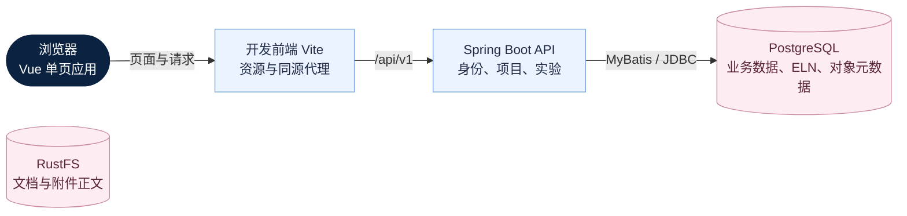

# 材料实验助手概要设计

_描述当前代码可证明的产品范围与架构；运行验收记录独立保存在 audit。_

---

## 🎯 目标与适用范围

材料实验助手是面向材料研发团队的独立 Web 系统。组织承担数据隔离，项目组织研发协作，
实验与 ELN 记录计划、过程和结果。技术实现为 Vue 前端和 Java API；当前仓库不包含桌面客户端或外部单点登录实现。

本文与[详细设计](detailed-design.md)、[运维指南](development-operations-guide.md)共同维护现行规范，
代码核验基线和本次验证见[文档重写记录](../audit/logs/2026-09-07-documentation-rewrite.md)。

## 📋 能力范围

“已接通”表示当前源码存在前后端调用及持久化路径，不表示已在目标服务器完成验收。

| 领域 | 已接通范围 | 限制 |
| --- | --- | --- |
| 身份与用户 | 本地密码登录、Session、CSRF、管理员签发一次性邀请码注册、普通用户创建/停用/密码重置、自助改密；独立生产首次身份初始化 | 邀请注册仅创建预绑定角色的普通用户；用户管理和邀请码管理限超级管理员；初始化拒绝非空库 |
| 项目 | 查询、创建、基本字段/目标/里程碑更新、关注、归档 | 成员表读取已接通，成员列表写入未闭合；创建不具备后端幂等去重 |
| 总览 | 可见项目与实验指标、项目卡片 | 趋势接口的 `project_id` 仅回显，未实际过滤查询 |
| 项目文档 | 分类检索、真实上传、原件下载、前端支持格式预览 | 新正文存于 RustFS，历史 BYTEA 仅读取兼容；后端不转换办公文件 |
| 实验与 ELN | 查询、创建、计划、参与人及正文增量更新、开始和完成 | 完成后不可编辑；记录数组按已提交字段整体替换 |
| 复制与实验附件 | 页面本地复制及专用复制 API；附件上传、授权读取和删除 | 附件正文存于 RustFS；复制不继承结果正文与附件 |
| 数据资产、任务、检测、报告 | 无完整业务链路 | 数据资产/任务入口未开放；保留组件和字段不是上线功能 |

功能字段和 API 的具体差异统一见[实现限制](detailed-design.md#implementation-limits)。

## 👥 角色与数据边界

组织角色决定功能权限，项目成员和实验参与关系进一步限制对象范围。

| 角色 | 功能权限 | 对象范围 |
| --- | --- | --- |
| 平台管理员 | 查看组织目录、开通新组织及首个组织管理员 | 不读取或管理其他组织的业务数据；首版只由 bootstrap 首个管理员持有 |
| 超级管理员 | 组织内用户管理及业务权限通配 | 读取当前组织数据；已完成实验仍受只读限制 |
| 项目管理员 | 项目、文档、实验的读写及状态操作 | 非全组织放行；需满足项目或实验关系 |
| 实验员 | 查看项目/文档/实验，更新实验与迁移状态 | 更新限直接实验关系；不可调整实验归属项目或负责人 |

上表概括通常的数据读取规则；实验负责人和参与人可读取直接关联实验，实验关联项目写入
对所有角色校验当前组织，超级管理员仅跳过项目管理成员资格检查。
当前组织用户选项还要求 `project.create` 权限。权限码、关系角色及前后端限制详见详细设计。
生产首次 bootstrap 创建首个组织、首个超级管理员和唯一初始平台管理员。平台管理员可开通后续独立组织，并为每个新组织原子创建首个超级管理员、三个内置角色及其权限；该组织管理员不继承平台权限。组织管理员可直接创建本组织普通用户，或签发绑定本组织角色和有效期的一次性邀请码；邀请码库仅保存 SHA-256 哈希，明文只在签发时返回一次。注册用户不能自行选择组织、角色或超级管理员身份。

当前一个登录账号只属于一个组织，用户名在全平台唯一；不支持同一账号跨组织成员身份、组织切换或平台管理员读取其他组织的业务数据。项目、实验、文件对象键、邀请码与普通用户管理均按当前会话组织隔离。
用户管理接口不能修改或重置超级管理员，系统角色名称也不等于自动获得超级管理员标记。所有已登录用户均可验证旧密码后修改自己的密码，成功后当前 Session 立即失效并需重新登录。

## 🌐 当前系统架构

下图展示开发部署的运行和读写关系。RustFS 由 API 通过 S3 兼容接口访问；项目不使用 Redis。
该 Mermaid 是本架构图的正式编辑源，后续导出以它为源，不独立维护。

| 组件 | 当前职责 | 实现入口 |
| --- | --- | --- |
| Vue/TypeScript | 路由、会话状态、表单与浏览器文档预览 | [frontend/src](../frontend/src/) |
| Spring Boot/MyBatis | 认证、范围校验、事务、JSON 与二进制接口 | [backend/src/main/java](../backend/src/main/java/) |
| PostgreSQL/Flyway | 业务表、JSONB ELN、对象元数据、历史 BYTEA 兼容正文及迁移 | [迁移目录](../backend/src/main/resources/db/migration/) |
| RustFS | 新上传项目文档和实验附件正文 | [开发 Compose](../infra/docker-compose.yml) |

API Session 当前保存在应用进程中，没有 Redis Session 集成。不能据此声明已支持横向扩容和会话高可用。

## 📚 业务与数据流

项目创建后可维护目标、里程碑和基础信息；在授权项目中创建实验并填写 ELN，
通过版本校验依次开始、完成实验。项目文档独立上传并归入六类资料。

实验只允许 `not_started → in_progress → completed`。完成后禁止更新和继续迁移；
当前没有完成后修订、审批或签名流程。项目归档不等于实验完成，也不能推导所有项目子资源自动只读。

项目文档上传先写入 RustFS，再保存元数据与对象标识；历史 BYTEA 正文仅为兼容读取保留。
DOCX、XLS/XLSX、PPTX、PDF、图片和文本的前端预览能力与服务端转换分开判定：
`/preview` 当前返回原件，不能保证将旧格式或解析失败的文件转换为 PDF。

开发种子数据由 `dev` Profile 下的初始化器补齐，来源为项目内开发夹具和历史原型记录。
页面从 API 获取数据不代表数据库里的样例是实际研发数据；生产数据不得通过开发初始化生成。

## 🔐 安全与一致性

当前具备 Session/CSRF、组织及对象范围查询、密码哈希和部分版本并发校验。
上传安全、会话安全、审计覆盖和跨资源关系仍需按实际实现评审，不能把目标控制写成已完成措施。

项目与实验更新使用 `If-Match` 和 `version`；项目创建虽有前端幂等键，
但后端不读取该键。用户管理、上传和关注等操作也不能一概套用项目版本控制。

业务操作日志当前至少接通项目文档上传；数据库存在审计表不代表全部写操作均留痕。
现有响应中的 `request_id` 也不代表已建立跨组件统一链路追踪。

## 📦 部署与验收范围

现有 Compose 采用 Vite 与 Maven 开发运行方式，依赖前端已安装的 `node_modules`，
并固定启动 `dev`。新服务器复现开发环境的步骤见运维指南。

独立[生产 Compose](production-deployment.md)由 Nginx 托管构建后的前端并反代 API，
Java 以 `prod` 运行，PostgreSQL 仅在内部可达；空库真实身份通过一次性初始化任务建立。
开发图中的 Vite 在生产由 Nginx 替代；生产 RustFS 仅加入 API 内部网络，Redis 不启动。
生产资产与完整业务安全验收分别判定，不能通过启动开发 Compose 宣称生产上线。

验收按实际功能验证登录、可见范围、项目字段保存、文档往返读取、ELN 保存与冲突、完成后只读。
实验复制、附件写入与正文读取已经具备实现和单元测试，仍须在隔离数据库完成迁移及端到端业务验收后才能判定可上线。
健康接口、构建、单测、业务验收和部署结论分别记录。

容量、并发和恢复时长尚无本次实测基线，不承诺未经测试的指标。
历史截图和测试结论的适用范围见[审计说明](../audit/README.md)。
