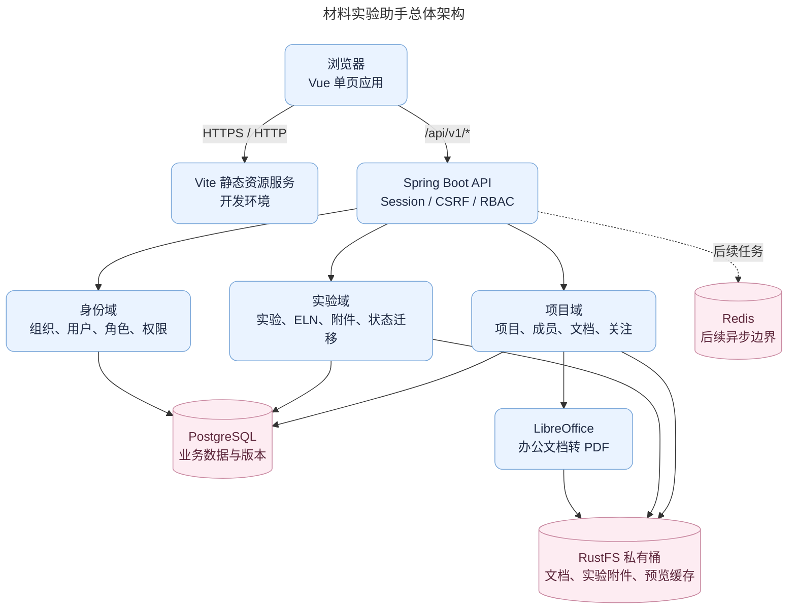
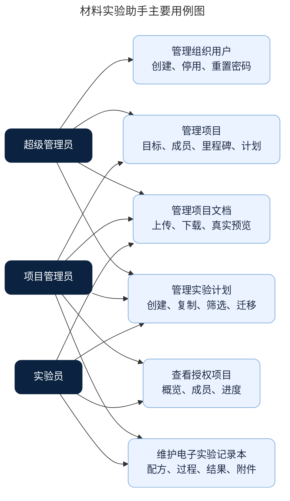
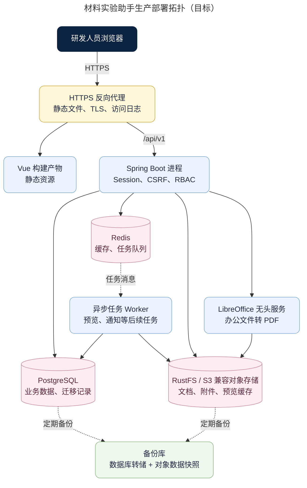

# 材料实验助手概要设计

## 1. 文档目的与基线

本文件是项目唯一的概要设计，面向评审、实施和交接。它描述已实现系统的范围、架构、关键约束、路线图与部署方式；字段级定义、接口参数和测试用例以《详细设计》和代码实现为准。

| 属性 | 值 |
|---|---|
| 文档状态 | 最新原型与 V1.0 需求对齐基线 |
| 代码基线 | `dev` 分支工作区（提交前审查） |
| 更新日期 | 2026-07-30 |
| 适用范围 | 项目管理、项目文档、实验管理、电子实验记录本、用户管理 |
| 正式细化来源 | [详细设计](detailed-design.md)、`backend/src/`、Flyway Migration、自动化测试 |

## 2. 建设目标与范围

材料实验助手是面向材料研发团队的独立 Web 系统，以组织为数据隔离边界，以项目为协作边界，以实验与电子实验记录本（ELN）为过程证据载体。

首期已实现能力如下：

- 项目创建、组合筛选、查询、编辑、成员与里程碑维护、关注、归档、操作记录和总览统计。
- 项目文档上传、分类检索、原文件下载，以及 PDF、图片和常见办公文档的真实内容预览。
- 实验创建、筛选、编辑、复制、开始/完成状态迁移和项目内实验视图。
- ELN 的结构化配方、过程、结果、真实附件增删与版本并发控制。
- 超级管理员用户管理、角色选项和密码重置；组织内 RBAC 与对象范围控制。

首期不包含数据资产、任务管理、检测委托、报告生成、材料主数据、对象存储直传和完整审计查询。
其中数据资产与任务管理仅按最新原型保留页签和“研发中”状态，不能被误认为已经上线。

### 2.1 业务角色与使用边界

系统同时使用“组织级角色”和“项目/实验内角色”。组织级角色决定能否进入某项能力；项目、实验内关系决定可见对象和协作身份。前端根据权限隐藏不适用操作，后端仍会逐次校验，不以页面按钮作为授权依据。

| 使用者 | 组织级能力 | 项目或实验内职责 | 典型操作 |
|---|---|---|---|
| 超级管理员 | 管理组织用户、重置密码、查看和维护全部业务数据 | 可被加入项目，但不因超级管理员身份自动改变项目成员展示 | 创建用户、分配系统角色、处理账号停用 |
| 项目管理员 | 与实验员具有相同业务功能权限 | 可在具体项目中担任负责人或成员 | 创建/编辑项目和实验、维护成员/里程碑、管理文档与 ELN |
| 实验员 | 与项目管理员具有相同业务功能权限 | 可在具体项目中担任负责人或成员，在实验中担任实验员或参与人 | 创建/编辑项目和实验、维护成员/里程碑、管理文档与 ELN |

### 2.2 范围判定原则

1. 页面显示“数据资产”和“任务管理”页签，但当前只保留研发中提示，不产生对应业务记录。
2. 文档资料和 ELN 附件均保存真实上传文件；演示数据仅用于开发初始化，不能作为生产事实来源。
3. 已完成或归档项目保持只读；已完成实验允许按需求补充或修订 ELN，并通过版本号和操作日志保留追踪信息。
4. 外部系统没有直接写入数据库的接口；未来对接必须经过 API 契约、组织隔离、权限和审计评审。

## 3. 技术选型

| 层级 | 已采用技术 | 选型原因 |
|---|---|---|
| 前端 | Vue 3、TypeScript、Vite、Pinia、Vue Router、Element Plus、ECharts | 适合单页业务系统、类型化接口和组件化交互 |
| 后端 | Java 25、Spring Boot、MyBatis、Flyway | 提供 Session/CSRF、事务、SQL Mapper 和可追溯迁移能力 |
| 数据库 | PostgreSQL | 关系约束、事务和 JSON 字段满足业务模型需求 |
| 缓存/任务 | Redis（基础配置已预留） | 为后续异步报告、文件处理和通知提供边界 |
| 文件预览 | Vue Office 组件、浏览器图片/文本能力、LibreOffice 无头转换 | 现代格式优先组件渲染，旧格式、超大文件或组件失败时转换为真实 PDF |
| 对象存储 | RustFS、S3 SigV4、path-style 私有桶 | 文件与应用进程解耦，保留 S3 兼容迁移能力 |
| 部署 | Conda 运行环境、Docker Compose（PostgreSQL/Redis/RustFS） | 便于局域网部署和数据卷隔离 |

## 4. 总体架构

## 5. 领域边界与职责

| 领域 | 主要实体 | 对外职责 | 不承担的职责 |
|---|---|---|---|
| 身份与权限 | 组织、用户、角色、权限 | 登录、会话、超级管理员用户管理、权限码判定 | 不替代项目或实验对象范围判断 |
| 项目管理 | 项目、成员、里程碑、关注 | 项目生命周期、成员协作、概览统计、业务编号 | 不保存 ELN 正文 |
| 项目文档 | 项目文档、预览缓存 | 上传、分类、下载和真实在线预览 | 不伪造或解析虚构内容 |
| 实验与 ELN | 实验、参与人、ELN、附件 | 实验计划、状态迁移、过程和结果留存 | 不实现检测或报告业务 |
| 公共能力 | 幂等请求、业务操作日志、分页、错误响应、请求编号 | 创建去重、关键变更追踪、并发冲突、统一错误模型 | 不包含业务规则本身 |

### 5.1 用例图（UML）

下图以系统权限和对象范围为前提描述主要用例。项目管理员与实验员具有相同业务功能权限，
但在不同项目或实验中可承担不同对象角色；图中“管理”不等于绕过后端权限校验。

## 6. 关键流程

### 6.1 项目到实验的业务闭环

### 6.2 文档预览流程

1. 当前用户先通过 `document.view` 权限和项目可见范围校验，所有组件只读取同源授权接口。
2. DOCX、XLS/XLSX、PPTX、PDF 分别由 Vue Office 专用组件解析；图片使用浏览器图片组件，
   TXT/CSV 使用有界文本或表格组件，不执行文件中的脚本。
3. DOC/PPT、ODT/ODS/ODP、RTF 等旧版或开放文档格式，以及超过组件体积边界的文件，
   直接使用 LibreOffice 转换 PDF。
4. DOCX、XLS/XLSX、PPTX 组件解析失败时自动请求服务端 PDF 兜底；PDF 组件失败时回退浏览器
   原生 PDF 查看器。全部失败后明确提示下载原文件，不展示模拟内容。
5. 办公文档从 RustFS 临时下载到受控临时目录转换，预览 PDF 回存
   `project-document-previews/<document_id>/<更新时间>/preview.pdf`；原文件更新后自动使用新对象键。

## 7. 安全与一致性原则

- 使用 Spring Security Session 与 CSRF，浏览器不保存认证令牌。
- 业务查询合并本人组织及下级组织范围，以及跨组织项目成员关系；文件读取复用相同对象范围。
- 项目和实验更新使用 `ETag` / `If-Match` 对应的 `version` 乐观锁；版本冲突返回 `412`。
- 项目创建使用 `Idempotency-Key`，相同键只能重放相同请求。
- 项目与实验附件采用服务端生成路径，原始文件名仅作为元数据保留。
- 已完成、已归档项目不可编辑；实验状态只能顺序迁移，完成后 ELN 修订仍受权限和乐观锁约束。

## 8. 部署架构与运行边界

开发服务器当前采用前后端分离进程：前端 Vite 监听 `5173`，Spring Boot API 监听 `8000`。
`infra/docker-compose.yml` 为 PostgreSQL、Redis 和 RustFS 提供独立数据目录映射；环境变量由
未提交的 `.env` 文件提供。RustFS API 和控制台只绑定回环地址，文件访问继续经过 Java API
Session、权限码、组织范围和对象范围校验。

| 组件 | 运行方式 | 数据位置/依赖 | 运维要点 |
|---|---|---|---|
| 前端 | `pnpm --dir frontend dev -- --host 0.0.0.0` | API 同源代理或 `/api/v1` 路径 | 生产环境应构建为静态文件并由反向代理托管 |
| API | `mvn -f backend/pom.xml spring-boot:run` | 数据库、RustFS 私有桶 | 生产环境应采用受控 Java 进程管理器 |
| PostgreSQL | Docker Compose | 独立 Docker 数据卷 | 必须执行备份和恢复演练 |
| Redis | Docker Compose | 独立 Docker 数据卷 | 后续异步任务启用前配置监控和重试策略 |
| RustFS | Docker Compose，S3 API `19000`、控制台 `19001` | `${MATERIALS_LAB_DATA_ROOT}/rustfs` | 使用随机密钥、私有桶、备份和对象一致性校验 |
| LibreOffice | 服务器系统依赖 | 临时转换目录、RustFS 预览缓存 | 转换失败不得降级为模拟预览 |

### 8.1 生产部署拓扑（目标架构）

下图是生产环境推荐拓扑，不代表当前开发服务器已经部署 Nginx 或独立会话存储。当前开发环境仍按本章开头的 Vite `5173` 和 Spring Boot `8000` 双进程运行；生产上线前应按《开发部署与运维指南》完成替换与演练。

生产部署的网络边界为：浏览器只能访问反向代理公开的 HTTPS 入口；数据库、Redis 和 RustFS
仅对应用进程、运维控制台隧道和备份任务开放；办公转换程序不直接对外暴露端口。代码、
数据库备份和对象存储备份必须记录同一应用提交号，才能保证恢复后引用关系一致。

## 9. 质量与风险

当前后端核心测试覆盖认证、用户、组织范围、项目、文档、实验和附件链路；本次基线
以 Maven/JUnit 核心路径测试为后端门禁。前端以 Node 单测、TypeScript 检查和 Vite
生产构建作为基础门禁。

| 风险 | 当前处理 | 后续措施 |
|---|---|---|
| 预览组件格式保真或兼容性不足 | 自动回退服务端 PDF，并始终保留原件下载 | 按真实业务模板维护兼容性样例，升级组件前执行浏览器回归 |
| 办公文档转换失败 | 返回明确错误并保留下载原件 | 将 LibreOffice 转换隔离为异步沙箱服务，增加病毒扫描和缓存清理 |
| RustFS 当前为预发布版本且开发环境为单节点 | 固定已验证镜像版本、保留 S3 兼容边界和本地迁移回滚副本 | 上线前完成压力、故障、升级与恢复演练，必要时平滑切换其他 S3 服务 |
| ELN 动态结构查询能力有限 | 正文采用受约束 JSON 字段 | 高频统计字段规范化并建立索引 |
| 开发服务器直接暴露 | 适用于局域网开发 | 生产部署统一接入 HTTPS、反向代理和进程守护 |
| 文档、测试、报告等扩展域未实现 | 在专题规范中明确为规划 | 按领域迁移、契约和验收用例逐步实现 |

## 10. 非功能性要求

| 维度 | 当前设计要求 | 验证方式 |
|---|---|---|
| 数据隔离 | 任一业务查询必须从当前组织范围开始，跨组织对象不得通过编号、UUID 或文件地址访问 | 越权接口测试、代码评审与生产抽查 |
| 一致性 | 项目和实验的关键写操作在数据库事务内完成；更新使用版本号检测并发冲突 | 并发更新测试、`412` 回归验证 |
| 可追溯性 | 业务对象保留创建/更新时间、创建/更新用户，文件保留上传人、原文件名、大小和 MIME 类型 | 数据库字段检查、下载和预览链路验证 |
| 可恢复性 | 数据库和 RustFS 原件必须作为同一恢复单元备份；预览缓存可重新生成 | 桶清单、SHA-256 抽检与定期恢复演练 |
| 可维护性 | 数据库结构只通过 Migration 演进；接口、权限、测试和规范同步变更 | 提交检查与发布清单 |
| 性能边界 | 默认分页 20 条、最大 100 条；项目文档 100 MB；过程图片单张 10 MB；结果附件单个 25 MB | API 参数校验、真实签名与上传回归测试 |

## 11. 交付与验收口径

一项功能可交付的最低条件是：接口已完成权限和对象范围校验，前端不使用模拟业务数据兜底，数据库变化已生成 Migration，核心异常路径有自动化测试，且三份正式规范中相应章节已更新。验收以真实浏览器操作和真实数据库/媒体文件结果为准，不能仅以页面静态展示判断完成。

针对本期系统，验收应至少覆盖：登录并恢复会话、超级管理员创建用户、创建并组合筛选项目、
编辑人员和唯一当前里程碑、归档与操作记录、上传并预览 DOCX/XLSX/PPTX/PDF、创建实验、
写入 ELN、上传/删除/读取实验附件、完成实验后留痕修订，以及组织层级和项目成员范围差异。

## 12. 规范组成

- [详细设计](detailed-design.md)：已实现的结构、字段、接口、权限和测试映射。
- [开发部署与运维指南](development-operations-guide.md)：环境、测试、发布、备份、协作和文档维护。
- [文档中心](README.md)：三份规范的阅读路径和当前代码基线。
